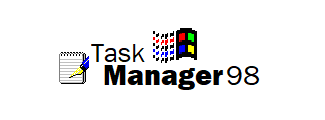

<p align="center">
  
</p>

# Task Manager App

This project is a Task Manager web application that demonstrates server-side rendering using Node.js, Express, and EJS, along with custom CSS styling that mimics a retro Windows98 aesthetic. Watch [this demo video on YouTube](https://youtu.be/5CqyP1htr5g) to see the app in action.

## Table of Contents

- [Features](#features)
- [Installation](#installation)
- [Database Setup](#database-setup)
- [Environment Variables](#environment-variables)
- [Running the App](#running-the-app)
- [Project Structure](#project-structure)
- [Usage](#usage)
  - [Adding Tasks](#1-adding-tasks)
  - [Toggling Task Completion](#2-toggling-task-completion)
  - [Deleting Tasks](#3-deleting-tasks)
  - [Searching Tasks](#4-searching-tasks)
  - [Filtering Tasks](#5-filtering-tasks)
  - [Sorting Tasks](#6-sorting-tasks)
- [License](#license)
- [Acknowledgments](#acknowledgments)

## Features

- **View Tasks:** Display a list of tasks stored in memory.
- **Add Task:** Create new tasks with a title, description, and priority.
- **Toggle Task Completion:** Mark tasks as complete or reopen them.
- **Delete Task:** Remove tasks from the list.
- **Search Tasks:** Filter tasks by title or description.
- **Filter Tasks:** Filter by task status (All, Completed, Incomplete).
- **Sort Tasks:** Sort tasks by priority (Low to High, High to Low) with an option to clear the sorting and revert to the default order.

## Installation

> [!NOTE]
>
> You will need to have [Node.js](https://nodejs.org/en/) (version 14 or later is recommended) and [npm](https://www.npmjs.com/) (comes with Node.js) installed on your machine.

### Steps

1. **Clone the Repository**

   ```bash
   git clone https://github.com/yourusername/task-manager-app.git
   cd task-manager-app
   ```

2. **Install Dependencies**

   ```bash
   npm install
   ```

## Database Setup

> [!NOTE]
>
> You will need to have the latest version of [PostgreSQL](https://www.postgresql.org/download/) installed on your machine.

1. **Login as Administrator**

   For Linux users:

   ```bash
   sudo -u postgres psql
   ```

   For macOS users:

   ```bash
   psql -U postgres
   ```

2. **Create a New Database**

   ```sql
   postgres=# CREATE DATABASE task_manager_db;
   ```

3. **Login to the Database**

   ```sql
   postgres=# \c task_manager_db
   ```

4. **Create a Role (User) to Access the Database**

   ```sql
   task_manager_db=# CREATE ROLE task_manager_user WITH LOGIN PASSWORD 'your_password';
   ```

> [!IMPORTANT]
>
> Replace `your_password` with a secure password of your choice.

5. **Grant Permissions to the User**

    ```sql
    postgres=# ALTER DATABASE task_manager_db OWNER TO task_manager_user;
    postgres=# GRANT CREATE ON DATABASE task_manager_db TO task_manager_user;
    ```

6. **Run the Schema to Create the Table**

   Use the provided schema file to create the `tasks` table:

   ```bash
   psql -d task_manager_db -f src/db/schema.sql
   ```

   Alternatively, you can manually create the table by running the following SQL command:

   ```sql
   task_manager_db=# CREATE TABLE IF NOT EXISTS tasks (
       id SERIAL PRIMARY KEY,
       title VARCHAR(100) NOT NULL,
       description TEXT,
       priority VARCHAR(10) DEFAULT 'low',
       completed BOOLEAN DEFAULT FALSE,
       created_at TIMESTAMP WITH TIME ZONE DEFAULT NOW()
   );
   ```

7. **Verify the Table**

   Check that the `tasks` table was created:

   ```sql
   task_manager_db=# \dt
   ```

## Environment Variables

Create a `.env` file in the root directory with the following content:

```env
DB_HOST=localhost
DB_PORT=5432
DB_USER=task_manager_user
DB_PASSWORD=your_password
DB_DATABASE=task_manager_db
```

Replace `your_password` with the password you set for the `task_manager_user` role.

## Running the App

1. **Build the Project**

   ```bash
   npm run build
   ```

2. **Start the Server**

   ```bash
   npm start
   ```

3. **Access the App**

   Open your browser and navigate to [http://localhost:3000](http://localhost:3000).

>[!TIP]
>
> Alternatively, if you want to run the app in development mode with live reloading:
>
> ```bash
> npm run dev
> ```

## Project Structure

```markdown
.
├── LICENSE
├── .env                         # Create this file for environment variables
├── .gitignore
├── package.json                 # Project metadata and dependencies
├── package-lock.json
├── public                       # Static files served to the client
│   └── styles.css
├── README.md
├── src                          # Source code for the application
│   ├── app.ts                   # Main application file
│   ├── config                   # Configuration files
│   │   └── dbConfig.ts          
│   ├── controllers              # Logic for handling requests
│   │   └── taskController.ts
│   ├── db                       # Database connection and schema
│   │   └── schema.sql
│   ├── middleware               # Middleware functions
│   │   ├── logger.ts
│   │   └── methodOverride.ts
│   ├── models                   # Data models and interfaces
│   │   └── taskModel.ts
│   ├── routes                   # Routes for handling requests
│   │   └── taskRoutes.ts
│   ├── utils                    # Utility functions
│   │   ├── dateUtils.ts
│   │   └── networkUtils.ts
│   └── views                    # EJS templates for rendering views
│       ├── error.ejs
│       ├── index.ejs
│       ├── partials             # Reusable components
│       │   ├── footer.ejs
│       │   └── header.ejs
│       └── update.ejs
└── tsconfig.json                # TypeScript configuration file
```

## Usage

### 1. Adding Tasks

- Fill in the **Add New Task** form by providing a title.
- Select a priority (`Low`, `Medium`, or `High`). The default is `Low`.
- Optionally, enter a description.
- Click `Add Task` to create the new task.

### 2. Toggling Task Completion

- Each task displays a `Complete` button (or `Reopen` if already completed).
- Clicking this button toggles the task's completion status.

### 3. Deleting Tasks

- Click the `Delete` button next to a task to remove it from the list.

### 4. Searching Tasks

- Use the search bar at the top of the task list.
- Enter keywords to search tasks by title or description.
- Click `Search` to update the list.

### 5. Filtering Tasks

- Under the search bar, the filter options (`All`, `Completed`, `Incomplete`) appear on the left.
- Choose the desired filter option and click `Apply Filter`.
- Hidden inputs preserve the search query and current sort state when filtering.

### 6. Sorting Tasks

- On the right side of the filter/sort container, use the sort dropdown to select a sort order:
  - `Low to High`: Sorts tasks by priority from low to high.
  - `High to Low`: Sorts tasks by priority from high to low.
- Click `Sort` to apply the selected sort.
- Click `Clear Sort` to remove the sorting and revert to the default order (sorted by task ID).

> [!TIP]
>
> You can combine search, filter, and sort functionalities in a single request:
>
> - Enter a keyword in the search bar.
> - Choose a task status (`All`, `Completed`, `Incomplete`).
> - Select a priority order.
> - Click the respective buttons in each form, and hidden inputs ensure that your search query, filter, and sort values are preserved across requests.

## License

This project is licensed under the [MIT License](LICENSE).

## Acknowledgments

- This project was developed as part of an assignment for the **[CMPS2212] GUI Programming** course under the Associate of Information Technology program at the [University of Belize](https://www.ub.edu.bz/).
- Shout out to [The Monospace Web](https://owickstrom.github.io/the-monospace-web/) for inspiring the aesthetic of the application.
- Special thanks to Mr. Dalwin Lewis for his guidance and support.
